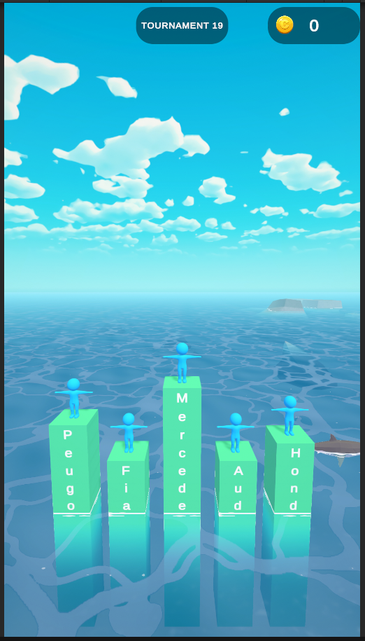
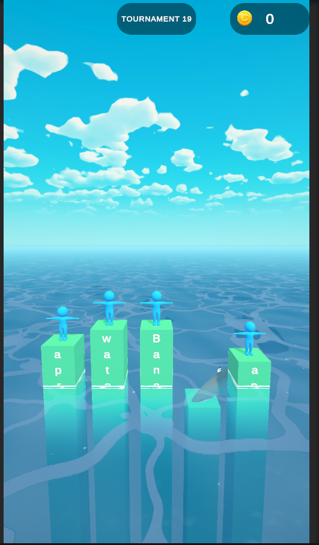
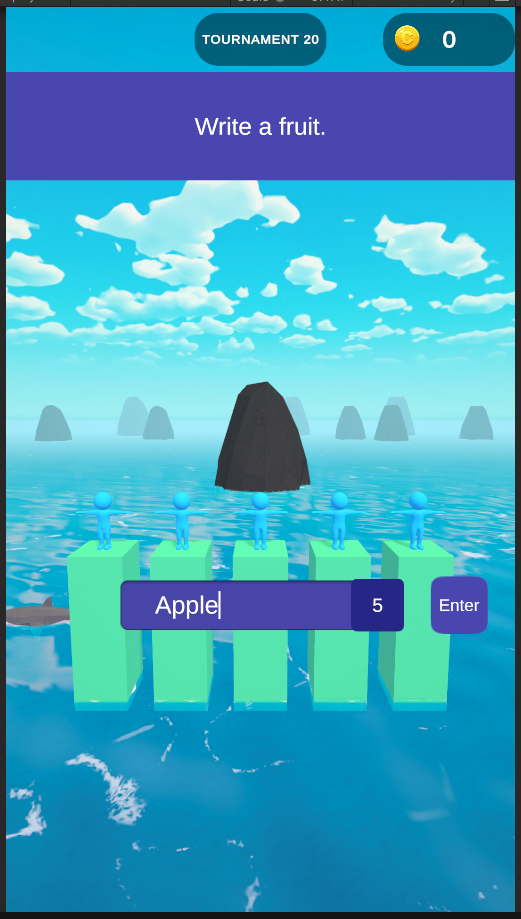
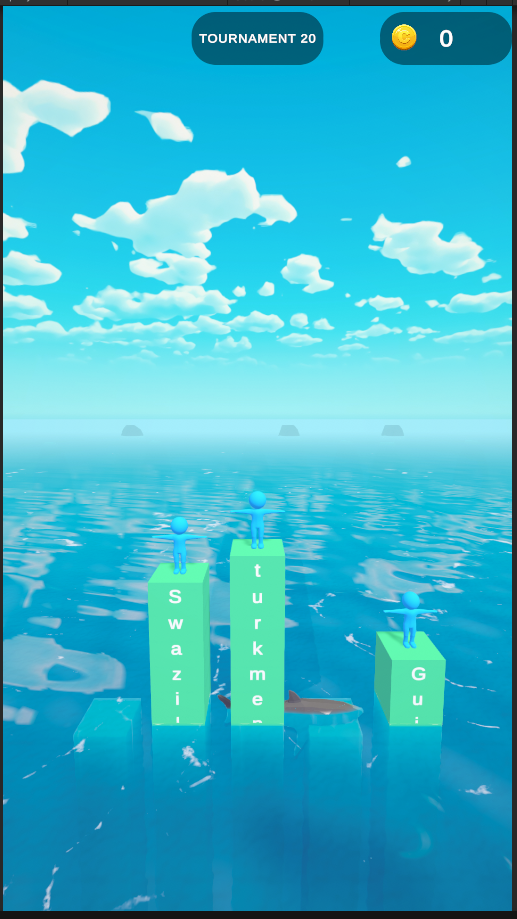

# TextOrDie

Solid prensiplerine uygun olarak hazırladığım bu projede ayrıca aşağıdaki pattern'leri ve optimizasyon yöntemlerini kullandım.

1.  Observer Pattern
2.  Command Pattern
3.  Object Pooling

# Images

